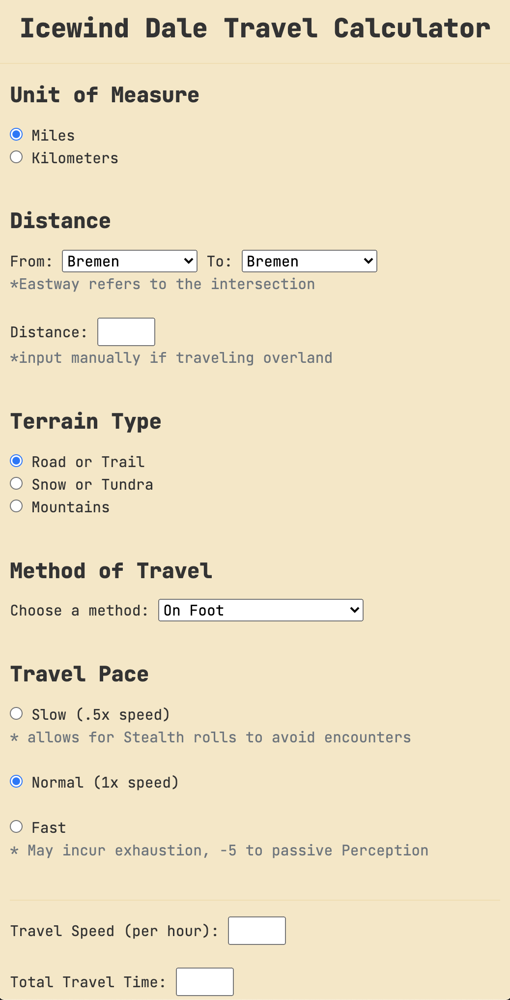

# Icewind Dale Travel Calculator

This calculator aims to replace/supplement the various charts and rules proposed for traveling around Icewind Dale by Justin Alexander in this blog post: https://thealexandrian.net/wordpress/45138/roleplaying-games/icewind-dale-travel-times

## Description

This calculator combines a couple of useful tools for calculating travel speed and time based on a number of factors such as method of travel, travel pace, and terrain. 

As it is currently designed, this calculator hard codes the rules as given in Justin's post. It should be easy enough to change these values by updating the appropriate data structures. Distances between towns use the Justin's rounded values, otherwise distances can be entered manually (ie, for overland travel).

### Dependencies

While this project is self-contained, it includes a few dependencies.

For calculating the distance between towns I've used the [shortestPath](https://github.com/noamsauerutley/shortest-path/blob/master/shortestPath.js) library that is based on Dijkstra’s algorithm.

The theme uses [Bootstrap](https://getbootstrap.com/) (via CDN) and a slightly modified version of the [Scrolls Theme](https://theme.typora.io/theme/Scrolls/).

## Authors

James Alday

## Acknowledgments

* [Bootstrap](https://getbootstrap.com/)
* Typora [Scrolls Theme](https://theme.typora.io/theme/Scrolls/)
* [shortestPath](https://github.com/noamsauerutley/shortest-path/blob/master/shortestPath.js) Library